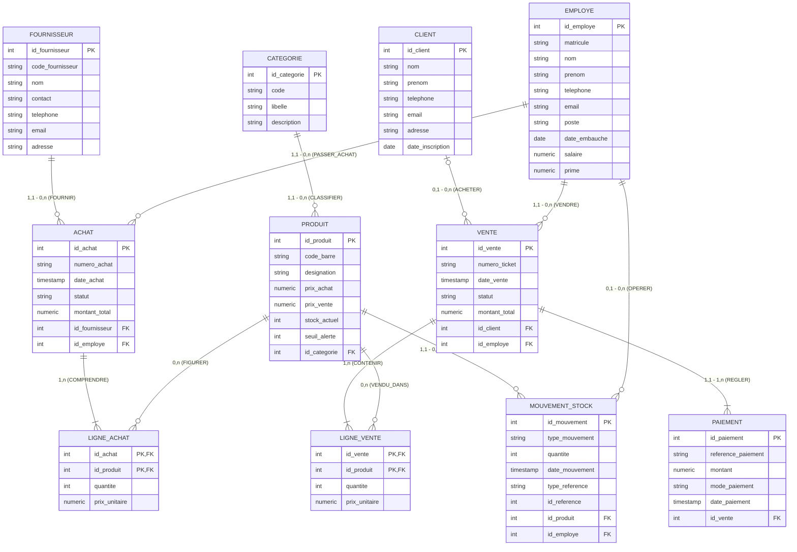

# MOLLY MARKET - DOSSIER DE CONCEPTION BASE DE DONNÉES

Ce document regroupe l'intégralité de la modélisation formelle de la base de données PostgreSQL de **Molly Market** selon la méthode MERISE.

---

## 1. Dictionnaire des Données

| Code | Libellé | Type SQL | Taille / Précision | Nature / Contraintes |
| :--- | :--- | :--- | :--- | :--- |
| **CLIENT** | | | | |
| `id_client` | Identifiant unique du client | SERIAL / INT | PK | Clé primaire |
| `nom` | Nom de famille | VARCHAR | 100 | NOT NULL |
| `prenom` | Prénom(s) | VARCHAR | 100 | NOT NULL |
| `telephone` | Numéro de téléphone | VARCHAR | 20 / 30 | NOT NULL |
| `email` | Adresse électronique | VARCHAR | 150 | UNIQUE, NULL |
| `adresse` | Adresse physique / commune | TEXT | - | NULL |
| `date_inscription` | Date d'enregistrement | TIMESTAMP | - | NOT NULL, DEFAULT NOW() |
| **EMPLOYE (UTILISATEUR)** | | | | |
| `id_employe` | Identifiant unique de l'employé | SERIAL / INT | PK | Clé primaire |
| `matricule` | Matricule interne | VARCHAR | 20 | NOT NULL, UNIQUE |
| `nom` | Nom de famille | VARCHAR | 100 | NOT NULL |
| `prenom` | Prénom(s) | VARCHAR | 100 | NOT NULL |
| `telephone` | Numéro de téléphone | VARCHAR | 20 / 30 | NOT NULL |
| `email` | Adresse email professionnelle | VARCHAR | 150 | NOT NULL, UNIQUE |
| `poste` / `role` | Rôle métier | VARCHAR / ENUM | 50 | NOT NULL ('Administrateur', 'Directeur', 'Vendeur', 'Magasinier') |
| `date_embauche` | Date d'embauche | DATE | - | NOT NULL |
| `salaire` | Salaire mensuel de base | NUMERIC | (12, 2) | CHECK (salaire >= 0) |
| `prime` | Prime éventuelle | NUMERIC | (12, 2) | CHECK (prime >= 0) |
| **FOURNISSEUR** | | | | |
| `id_fournisseur` | Identifiant du fournisseur | SERIAL / INT | PK | Clé primaire |
| `code_fournisseur`| Code fournisseur interne | VARCHAR | 20 | NOT NULL, UNIQUE |
| `nom` / `nom_entreprise`| Raison sociale | VARCHAR | 150 / 200 | NOT NULL |
| `contact` | Nom du commercial / contact | VARCHAR | 100 / 150 | NULL |
| `telephone` | Numéro de téléphone | VARCHAR | 20 / 30 | NOT NULL |
| `email` | Email commercial | VARCHAR | 150 | NULL |
| `adresse` | Adresse physique / localisation | VARCHAR / TEXT | 255 | NULL |
| **CATEGORIE** | | | | |
| `id_categorie` | Identifiant catégorie | SERIAL / INT | PK | Clé primaire |
| `code` | Code de la catégorie | VARCHAR | 50 | NOT NULL, UNIQUE |
| `libelle` / `nom` | Désignation de la catégorie | VARCHAR | 100 | NOT NULL |
| `description` | Description du rayon | TEXT | - | NULL |
| **PRODUIT** | | | | |
| `id_produit` | Identifiant du produit | SERIAL / INT | PK | Clé primaire |
| `code_barre` | Code-barres (EAN13 / SKU) | VARCHAR | 50 | NOT NULL, UNIQUE |
| `designation` / `nom` | Désignation commerciale | VARCHAR | 150 / 200 | NOT NULL |
| `id_categorie` | Rayon / Catégorie | INT | FK | Clé étrangère vers CATEGORIE |
| `prix_achat` | Prix d'achat unitaire | NUMERIC | (12, 2) | CHECK (prix_achat >= 0) |
| `prix_vente` | Prix de vente unitaire | NUMERIC | (12, 2) | CHECK (prix_vente >= 0) |
| `stock_actuel` | Quantité physique en stock | INT | - | CHECK (stock_actuel >= 0) |
| `seuil_alerte` | Seuil d'alerte rupture | INT | - | DEFAULT 10 |
| **ACHAT** | | | | |
| `id_achat` | Identifiant de la commande achat | SERIAL / INT | PK | Clé primaire |
| `numero_achat` | Référence bon de commande | VARCHAR | 30 | NOT NULL, UNIQUE |
| `id_fournisseur` | Fournisseur concerné | INT | FK | Clé étrangère vers FOURNISSEUR |
| `id_employe` | Employé créateur / acheteur | INT | FK | Clé étrangère vers EMPLOYE |
| `date_achat` | Date et heure de l'achat | TIMESTAMP | - | NOT NULL, DEFAULT NOW() |
| `statut` | Statut du flux d'achat | VARCHAR / ENUM | 50 | CHECK IN ('en_attente_paiement_directeur', 'paye_par_directeur', 'recu', 'annule') |
| `montant_total` | Montant total TTC | NUMERIC | (12, 2) | Calculé / Trigger (somme lignes) |
| **LIGNE_ACHAT** | | | | |
| `id_achat` | Achat associé | INT | PK, FK | Clé composite |
| `id_produit` | Produit commandé | INT | PK, FK | Clé composite |
| `quantite` | Quantité achetée | INT | - | CHECK (quantite > 0) |
| `prix_unitaire` | Prix d'achat négocié | NUMERIC | (12, 2) | NOT NULL, CHECK (prix_unitaire >= 0) |
| **VENTE** | | | | |
| `id_vente` | Identifiant de la vente | SERIAL / INT | PK | Clé primaire |
| `numero_ticket` | Numéro unique de ticket | VARCHAR | 30 | NOT NULL, UNIQUE |
| `id_client` | Client acheteur | INT | FK | Clé étrangère vers CLIENT (NULL si anonyme) |
| `id_employe` | Vendeur / Caissier | INT | FK | Clé étrangère vers EMPLOYE |
| `date_vente` | Date et heure de la vente | TIMESTAMP | - | NOT NULL, DEFAULT NOW() |
| `statut` | Statut de la vente | VARCHAR / ENUM | 20 | CHECK IN ('terminee', 'annulee') |
| `montant_total` | Montant total du ticket | NUMERIC | (12, 2) | Calculé / Trigger (somme lignes) |
| **LIGNE_VENTE** | | | | |
| `id_vente` | Vente associée | INT | PK, FK | Clé composite |
| `id_produit` | Produit vendu | INT | PK, FK | Clé composite |
| `quantite` | Quantité vendue | INT | - | CHECK (quantite > 0) |
| `prix_unitaire` | Prix de vente appliqué | NUMERIC | (12, 2) | NOT NULL, CHECK (prix_unitaire >= 0) |
| **PAIEMENT** | | | | |
| `id_paiement` | Identifiant de la transaction | SERIAL / INT | PK | Clé primaire |
| `reference_paiement` | Référence unique paiement | VARCHAR | 50 | NOT NULL, UNIQUE |
| `id_vente` | Vente réglée | INT | FK | Clé étrangère vers VENTE |
| `montant` | Montant versé | NUMERIC | (12, 2) | CHECK (montant > 0) |
| `mode_paiement` | Canal de règlement | VARCHAR / ENUM | 30 | CHECK IN ('especes', 'wave', 'orange_money', 'mtn_money', 'moov_money', 'carte_bancaire', 'cheque', 'virement') |
| `date_paiement` | Horodatage du paiement | TIMESTAMP | - | NOT NULL, DEFAULT NOW() |
| **MOUVEMENT_STOCK** | | | | |
| `id_mouvement` | Identifiant du mouvement | SERIAL / INT | PK | Clé primaire |
| `id_produit` | Produit impacté | INT | FK | Clé étrangère vers PRODUIT |
| `id_employe` | Opérateur / Magasinier | INT | FK | Clé étrangère vers EMPLOYE |
| `type_mouvement` | Nature du flux | VARCHAR / ENUM | 30 | CHECK IN ('entree_achat', 'sortie_vente', 'ajustement_inventaire', 'retour_client', 'perte') |
| `quantite` | Quantité déplacée (+ ou -) | INT | - | NOT NULL |
| `date_mouvement` | Date et heure du mouvement | TIMESTAMP | - | NOT NULL, DEFAULT NOW() |
| `type_reference` | Contexte du document | VARCHAR | 20 | CHECK IN ('ACHAT', 'VENTE', 'INVENTAIRE', 'PERTE') |
| `id_reference` | ID de la pièce d'origine | INT | - | Référence contextuelle |

---

## 2. Structure d'Accès Théorique (SAT) & Dépendances Fonctionnelles

### Table des Dépendances Fonctionnelles Directes
- `id_client` $\rightarrow$ `nom`, `prenom`, `telephone`, `email`, `adresse`, `date_inscription`
- `id_employe` $\rightarrow$ `matricule`, `nom`, `prenom`, `telephone`, `email`, `poste`, `date_embauche`, `salaire`, `prime`
- `id_fournisseur` $\rightarrow$ `code_fournisseur`, `nom`, `contact`, `telephone`, `email`, `adresse`
- `id_categorie` $\rightarrow$ `code`, `libelle`, `description`
- `id_produit` $\rightarrow$ `code_barre`, `designation`, `prix_achat`, `prix_vente`, `stock_actuel`, `seuil_alerte`, `id_categorie`
- `id_achat` $\rightarrow$ `numero_achat`, `date_achat`, `statut`, `montant_total`, `id_fournisseur`, `id_employe`
- `(id_achat, id_produit)` $\rightarrow$ `quantite`, `prix_unitaire`
- `id_vente` $\rightarrow$ `numero_ticket`, `date_vente`, `statut`, `montant_total`, `id_client`, `id_employe`
- `(id_vente, id_produit)` $\rightarrow$ `quantite`, `prix_unitaire`
- `id_paiement` $\rightarrow$ `reference_paiement`, `montant`, `mode_paiement`, `date_paiement`, `id_vente`
- `id_mouvement` $\rightarrow$ `type_mouvement`, `quantite`, `date_mouvement`, `type_reference`, `id_reference`, `id_produit`, `id_employe`

Toutes les dépendances fonctionnelles élémentaires ont pour source une clé candidate (3FN & Forme Normale de Boyce-Codd respectées).

---

## 3. Modèle Conceptuel de Données (MCD)

### Liste des Associations et Cardinalités MERISE

1. **CLASSIFIER** : `CATEGORIE` (0,n) --- (1,1) `PRODUIT`
   - Une catégorie contient 0 à plusieurs produits.
   - Un produit appartient obligatoirement à 1 et 1 seule catégorie.

2. **COMMANDER (Ligne Achat)** : `ACHAT` (1,n) --- [LIGNE_ACHAT: quantite, prix_unitaire] --- (0,n) `PRODUIT`
   - Un achat contient 1 à n lignes de produits.
   - Un produit peut figurer dans 0 à n commandes d'achat.

3. **FOURNIR** : `FOURNISSEUR` (0,n) --- (1,1) `ACHAT`
   - Un fournisseur peut recevoir 0 à plusieurs bons d'achat.
   - Un achat est passé auprès d'exactement 1 fournisseur.

4. **PASSER_ACHAT** : `EMPLOYE` (0,n) --- (1,1) `ACHAT`
   - Un employé peut enregistrer 0 à plusieurs achats.
   - Un achat est saisi par 1 employé.

5. **ACHETER** : `CLIENT` (0,n) --- (0,1) `VENTE`
   - Un client peut effectuer 0 à plusieurs achats.
   - Une vente peut être rattachée à 0 ou 1 client (achat anonyme comptoir).

6. **ENCAISSER / EFFECTUER** : `EMPLOYE` (0,n) --- (1,1) `VENTE`
   - Un employé vendeur réalise 0 à n ventes.
   - Une vente est obligatoirement réalisée par 1 employé vendeur.

7. **CONTENIR (Ligne Vente)** : `VENTE` (1,n) --- [LIGNE_VENTE: quantite, prix_unitaire] --- (0,n) `PRODUIT`
   - Une vente comprend 1 à n produits vendus.
   - Un produit peut être vendu 0 à n fois.

8. **REGLER** : `VENTE` (1,n) --- (1,1) `PAIEMENT`
   - Une vente génère 1 ou plusieurs paiements (multi-paiement possible : ex. espèces + Wave).
   - Un paiement est rattaché à 1 et 1 seule vente.

9. **IMPACTER_STOCK** : `PRODUIT` (0,n) --- (1,1) `MOUVEMENT_STOCK`
   - Un produit subit 0 à plusieurs mouvements de stock.
   - Un mouvement concerne exactement 1 produit.

10. **OPERER_STOCK** : `EMPLOYE` (0,n) --- (0,1) `MOUVEMENT_STOCK`
    - Un employé opère 0 à plusieurs mouvements.
    - Un mouvement est opéré par 0 ou 1 employé.

---

## 4. Modèle Logique de Données (MLD)

Règles de passage MCD $\rightarrow$ MLD appliquées rigoureusement :

- **CLIENT** (<ins>id_client</ins>, nom, prenom, telephone, email, adresse, date_inscription)
- **EMPLOYE** (<ins>id_employe</ins>, matricule, nom, prenom, telephone, email, poste, date_embauche, salaire, prime)
- **FOURNISSEUR** (<ins>id_fournisseur</ins>, code_fournisseur, nom, contact, telephone, email, adresse)
- **CATEGORIE** (<ins>id_categorie</ins>, code, libelle, description)
- **PRODUIT** (<ins>id_produit</ins>, code_barre, designation, prix_achat, prix_vente, stock_actuel, seuil_alerte, #id_categorie)
- **ACHAT** (<ins>id_achat</ins>, numero_achat, date_achat, statut, montant_total, #id_fournisseur, #id_employe)
- **LIGNE_ACHAT** (<ins>#id_achat, #id_produit</ins>, quantite, prix_unitaire)
- **VENTE** (<ins>id_vente</ins>, numero_ticket, date_vente, statut, montant_total, #id_client, #id_employe)
- **LIGNE_VENTE** (<ins>#id_vente, #id_produit</ins>, quantite, prix_unitaire)
- **PAIEMENT** (<ins>id_paiement</ins>, reference_paiement, montant, mode_paiement, date_paiement, #id_vente)
- **MOUVEMENT_STOCK** (<ins>id_mouvement</ins>, type_mouvement, quantite, date_mouvement, type_reference, id_reference, #id_produit, #id_employe)
