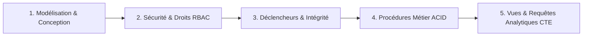

# GUIDE DE PRÉSENTATION ORALE - PROJET POSTGRESQL MOLLY MARKET

Ce guide vous donne le plan étape par étape, le discours à tenir et les requêtes SQL de démonstration à exécuter en direct devant le jury dans **pgAdmin 4**.

---

## 🎯 Plan de présentation en 5 étapes (Durée : 10 à 15 min)



---

## Étape 1 : Présentation de la Conception & du Schéma Relationnel (2 min)

### 🗣️ Discours :
> *"Pour répondre au cahier des charges de Molly Market, nous avons réalisé une modélisation complète selon la méthode MERISE avec le Dictionnaire de données, la Structure d'Accès Théorique (SAT), le MCD et le MLD normalisé en 3ème Forme Normale (3FN).*
> *Notre base de données PostgreSQL `mollymarket_backend` comporte 11 tables interconnectées avec des contraintes d'intégrité strictes (clés primaires composites, clés étrangères avec CASCADE ou RESTRICT, et contraintes CHECK)."*

### 💻 Dans pgAdmin (Démonstration visuelle) :
1. Dans l'arborescence à gauche, dépliez :  
   `mollymarket_backend > Schemas > public > Tables`
2. Faites un clic droit sur la table `produits` > **View/Edit Data > First 100 Rows** pour montrer le catalogue réel avec les prix en FCFA et les seuils d'alerte.
3. Montrez dans l'onglet **SQL** la structure de la table avec les contraintes CHECK (`prix_vente >= 0`, `stock_actuel >= 0`).

---

## Étape 2 : Sécurité & Gestion des Rôles RBAC (2 min)

### 🗣️ Discours :
> *"Conformément aux exigences de sécurité en entreprise, nous avons mis en place un contrôle d'accès basé sur les rôles (RBAC). 4 rôles métier ont été créés avec des privilèges stricts sur les tables et procédures."*

### 💻 Requête de démonstration dans le Query Tool :
```sql
-- 1. Afficher les rôles créés dans PostgreSQL
SELECT rolname, rolcanlogin, rolsuper 
FROM pg_roles 
WHERE rolname IN ('role_admin', 'role_directeur', 'role_vendeur', 'role_magasinier');

-- 2. Montrer les privilèges accordés au caissier (lecture produits, création ventes, aucun accès aux salaires)
SELECT table_name, privilege_type 
FROM information_schema.role_table_grants 
WHERE grantee = 'role_vendeur';
```

---

## Étape 3 : Déclencheurs (Triggers) & Règles d'intégrité (3 min)

### 🗣️ Discours :
> *"Toute la cohérence des données est garantie au niveau du SGBD grâce à nos déclencheurs (triggers PL/pgSQL). Par exemple :*
> *1. Le calcul automatique du montant total d'une vente à partir de ses lignes.*
> *2. La mise à jour instantanée du stock physique et la création automatique d'un enregistrement dans l'historique des mouvements de stock.*
> *3. Le blocage immédiat de toute tentative de stock négatif ou prix négatif.*
> *4. Le journal d'audit des suppressions (Journal_suppressions)."*

### 💻 Requête de démonstration en direct :

```sql
-- DÉMO TRIGGER : Tenter d'insérer un produit avec un prix négatif (PostgreSQL doit rejeter)
INSERT INTO produits (code_barre, nom, categorie_id, prix_vente, prix_achat, stock_actuel)
VALUES ('TEST-ERR', 'Produit Erreur', 1, -500, 200, 10);
-- Résultat attendu : ERROR: La contrainte check ou le trigger bloque l'insertion !
```

---

## Étape 4 : Procédures Stockées Métier ACID (4 min)

### 🗣️ Discours :
> *"L'application Web n'effectue aucun calcul métier. Lorsqu'un caissier valide un panier, il appelle simplement la procédure stockée `effectuer_vente`. Celle-ci s'exécute dans une transaction ACID complète : validation du stock, insertion du ticket, insertion des lignes, calculs, décrémentation des stocks, génération du mouvement et enregistrement du paiement."*

### 💻 Requête de démonstration en direct :

```sql
-- 1. Vérifier le stock avant la vente du produit ID 1 (ex: Riz)
SELECT id, nom, stock_actuel FROM produits WHERE id = 1;

-- 2. Exécuter la procédure de vente directement en SQL (Vente de 2 unités au client ID 1)
CALL effectuer_vente(
    1,                                      -- id_client
    3,                                      -- id_vendeur (Noam Koffi)
    '[{"produit_id": 1, "quantite": 2, "prix_unitaire": 18500}]'::JSONB, -- Lignes d'articles
    'wave',                                 -- Mode de paiement
    37000,                                  -- Montant versé
    'TICKET-DEMO-JURY-01'                   -- Numéro de ticket
);

-- 3. Constater que le stock a été décrémenté automatiquement par PostgreSQL
SELECT id, nom, stock_actuel FROM produits WHERE id = 1;

-- 4. Constater que la ligne de vente et le paiement ont été créés
SELECT * FROM ventes WHERE numero_ticket = 'TICKET-DEMO-JURY-01';
SELECT * FROM paiements WHERE vente_id = (SELECT id FROM ventes WHERE numero_ticket = 'TICKET-DEMO-JURY-01');

-- 5. Constater la trace d'audit dans les mouvements de stock
SELECT * FROM mouvements_stock WHERE reference_document = 'TICKET-DEMO-JURY-01';
```

---

## Étape 5 : Vues Statistiques, Fonctions PL/pgSQL & CTE (3 min)

### 🗣️ Discours :
> *"Pour le tableau de bord décisionnel de la direction, nous avons créé des vues dynamiques, des fonctions scalaires et des requêtes analytiques utilisant les CTE (Common Table Expressions) et le fenêtrage (Window Functions RANK)."*

### 💻 Requêtes de démonstration dans le Query Tool :

```sql
-- 1. Vue d'ensemble du tableau de bord (Chiffre d'affaires, alertes, total clients)
SELECT * FROM vue_statistiques;

-- 2. Vue du Top 5 des produits les plus vendus
SELECT * FROM vue_top_produits LIMIT 5;

-- 3. Fonction PL/pgSQL calculant le chiffre d'affaires
SELECT chiffre_affaires('mois') AS ca_du_mois;

-- 4. Requête analytique CTE avec fenêtrage (Ranking des meilleurs clients)
WITH meilleurs_clients AS (
    SELECT 
        c.nom, c.prenom,
        COUNT(v.id) AS nb_commandes,
        SUM(v.montant_total) AS total_depense,
        RANK() OVER (ORDER BY SUM(v.montant_total) DESC) AS rang
    FROM clients c
    JOIN ventes v ON v.client_id = c.id
    GROUP BY c.id, c.nom, c.prenom
)
SELECT * FROM meilleurs_clients WHERE rang <= 5;
```

---

## 🏆 Récapitulatif des arguments clés pour le Jury :

1. **Intégrité 100% SGBD** : Même si le serveur Web s'éteint ou si une autre application se connecte à la base, les règles métier et les stocks restent intègres et inviolables.
2. **Performance optimale** : Tous les calculs s'exécutent en mémoire locale du serveur PostgreSQL (C/C++) sans allers-retours réseau inutiles.
3. **Traçabilité totale** : Journalisation systématique des mouvements de stock, historique des prix et journal des suppressions (Audit trail).
